# Trees 
> ## AVL-Trees (Adelson-Velskii and Landis)


https://github.com/itamames/Lecture9

## The Model of the AVL Trees  

Definition: 
The AVL-tree is a binary search tree with a balance condition that ensures that the depth of the tree in O(logN)).

https://en.wikipedia.org/wiki/AVL_tree

Balance condition: 
* For every node in the tree, the height of the left and right subtrees can differ by at most 1. 
* We assume that the height of an empty tree is defined to be −1.

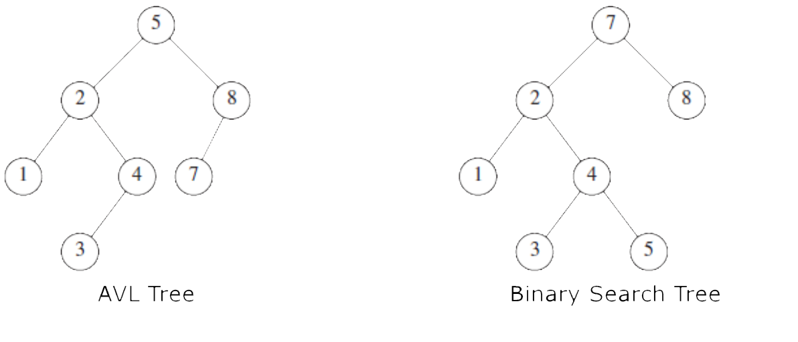

## Model of the AVL Tree

Is this a proper AVL Tree?

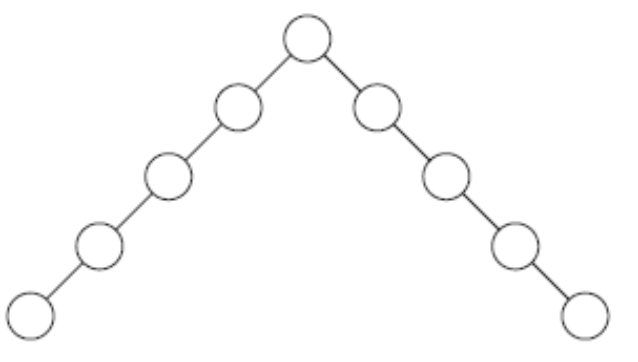

.

.

.

Nope!, because the balance condition is for every node of the tree! This is a “bad” binary search tree.

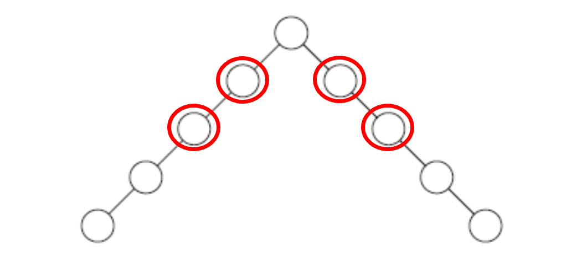

balance(node) = height(node.left) – height(node.right)

AVL property: –1 <= balance(x) <= 1  //for every node x  

## Example: 

The AVL tree of height 9 with the smallest number of nodes (143)


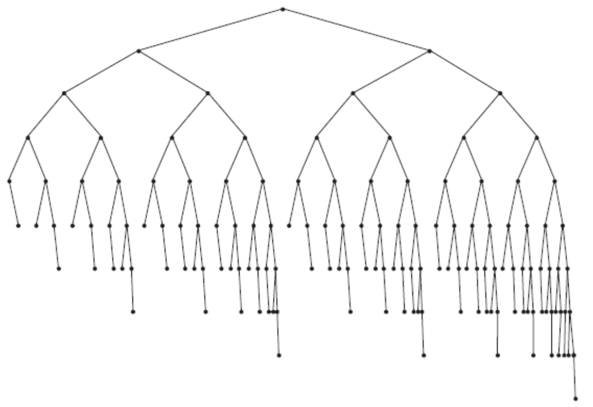

* Left subtree - AVL tree of height 7 of minimum size. 
* Right subtree - AVL tree of height 8 of minimum size.

Then we have: the minimum number of nodes, S(h), in an AVL tree of height h is given by:
```text
S(h) = S(h−1) + S(h−2) + 1
    for h = 0, S(h) = 1,
    for h = 1, S(h) = 2.
```
### Theorem:

> An AVL tree with N nodes has O(logN) height. 

### Proof: (some ideas)

N(h) = minimum number of nodes in an AVL tree of height h. 

Base cases:

N(0) = 1, N(1) = 2

Induction:

N(h) = N(h-1) + N(h-2) + 1

...

Sounds familiar? (fibbonacci)

## Important points:
Operations Contain/Find, Insert and Delete (lazy deletion) can be performed in O(logN) time.

When we do an insertion, we need to update all the balancing information for the nodes on the path back to the root, but the reason that insertion is potentially difficult is that inserting a node could violate the AVL tree property. 

Lazy deletion: Each node contains a boolean field indicating if they are deleted or not. To delete a key from the tree, just find the node containing that key and mark it as deleted.

### Example: 

When we insert the key 6 into the AVL tree we would destroy the balance condition 

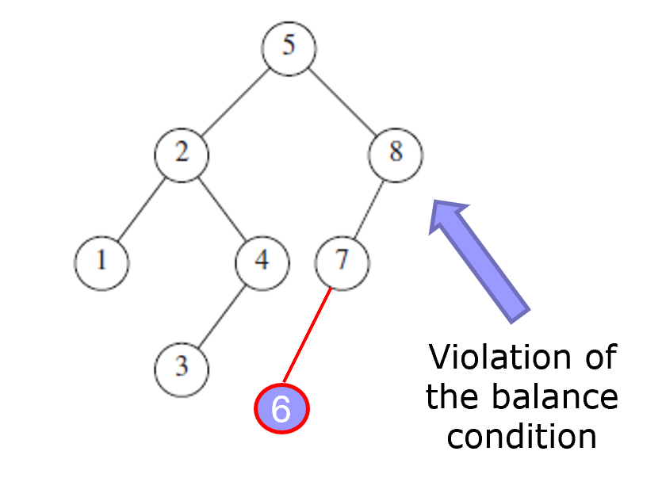

## AVL tree operations 

* AVL Find: 
    * Same as BST find

* AVL Insert: 
    * BST insert, then check balance and potentially “repair” the AVL tree
    * Four different imbalance cases

* AVL Delete: 
    * The “easy way” is lazy deletion.

## Insert: detect potential imbalance  

Algorithm Ideas:

Insert the new node as in a BST (a new leaf)

Verify that for each node on the path (from the root to the new leaf), the insertion may (or may not) have changed the node’s height

If height imbalance is detected (after insertion) then perform a rotation to restore balance at that node

All the action is in defining the correct rotations to restore balance

## Example:

	Insert(5)
	Insert(3)
	Insert(1)

Third insertion violates balance property!!!

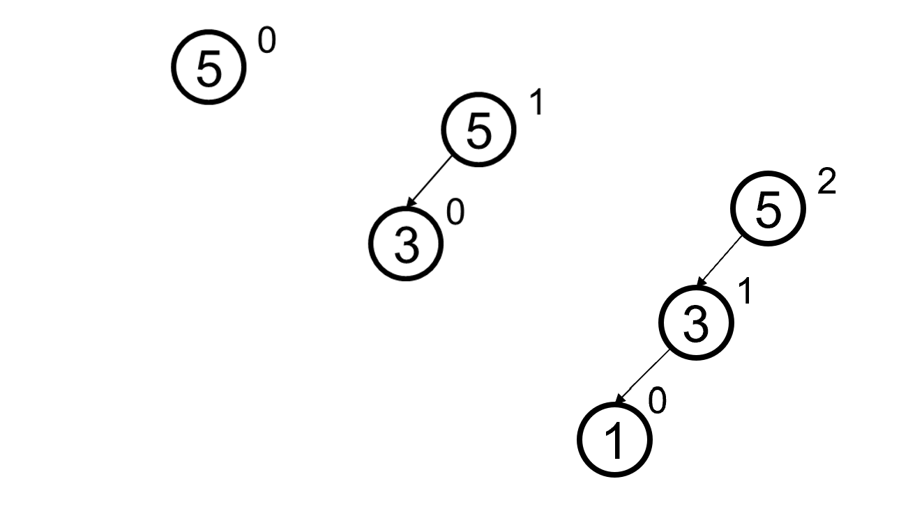

How to repair this height imbalance?

### Make a single rotation!

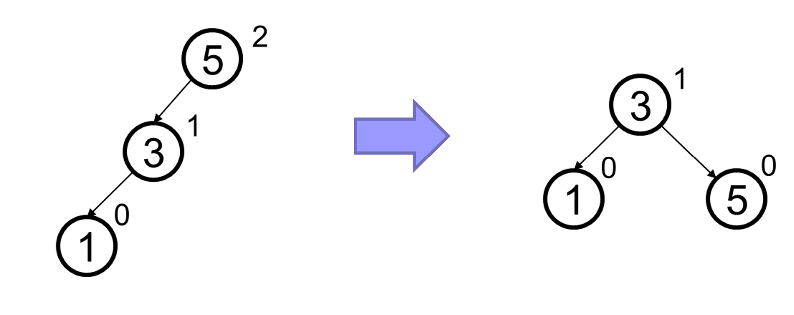

## AVL Insert: 
>### Single Rotation  

General Case:

Insertion into left-left grandchild causes an height imbalance
* 1 of 4 possible imbalance causes (other 3 coming up!)

When inserting a new node (red dot) an height imbalance occurs in the AVL tree (specifically node A is imbalanced)

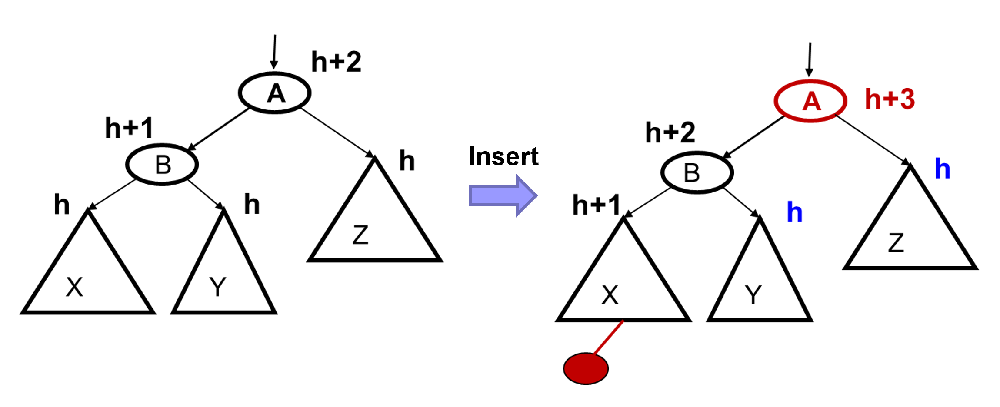

> General Case (left-left grandchild):

So we rotate at node A:
* Move child of unbalanced node into parent position
* Parent becomes the “other” child
* Other sub-trees move in the only way BST allows: 
    * using BST facts: X < b < Y < a < Z


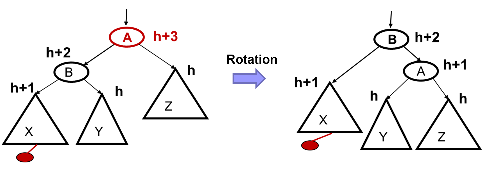

Example:
```text
    insert(16
```

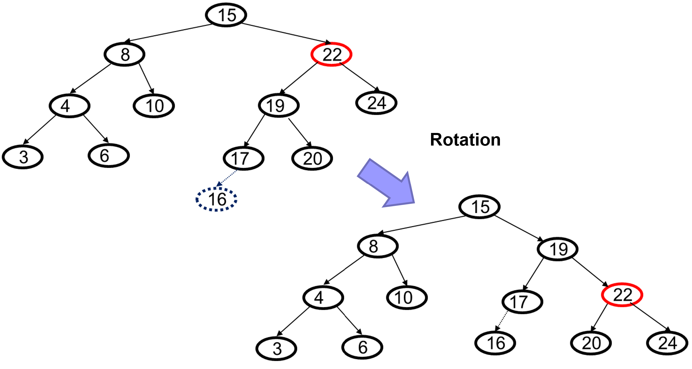

> General Case (right-right grandchild):

* Mirror image to left-left general case, so you rotate the other way
* Note that the concepts are the same concept, but need different code

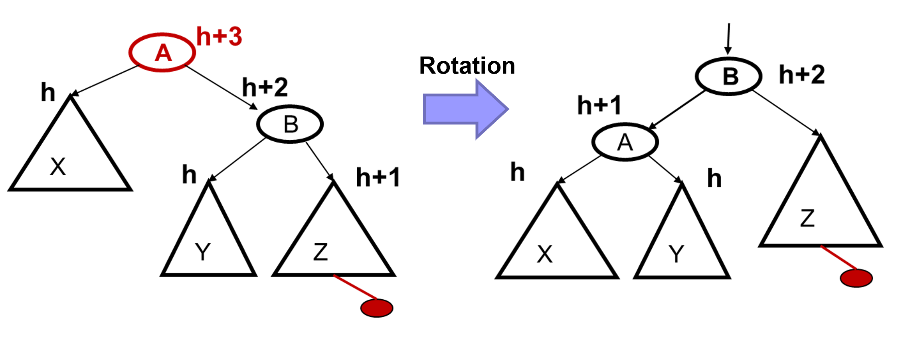

Example (right-right grandchild):
```text
insert(5) 
```
Creates a height imbalance at node 3.

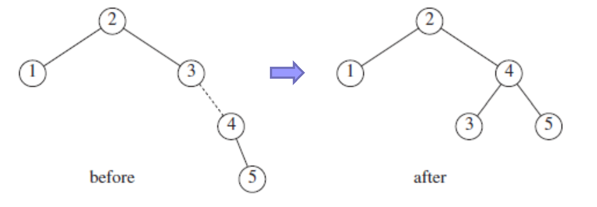
```text
insert(6) 
```
Creates a height imbalance at root.

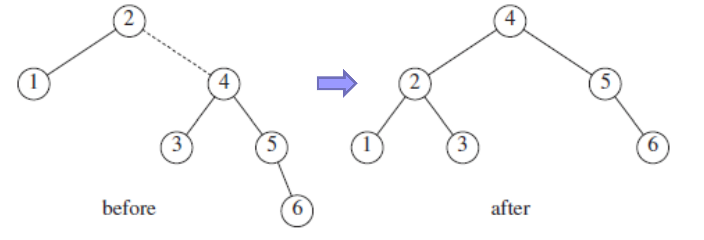

## Insert: Other cases  

* Note that single rotations are not enough for insertions in the left-right subtree or the right-left subtree

Example: 
```text
insert(1), insert(5), insert(3)
```
1st wrong idea: single rotation for left-left subtree

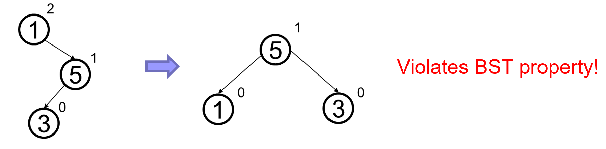


2nd wrong idea: single rotation on the child of the unbalanced node

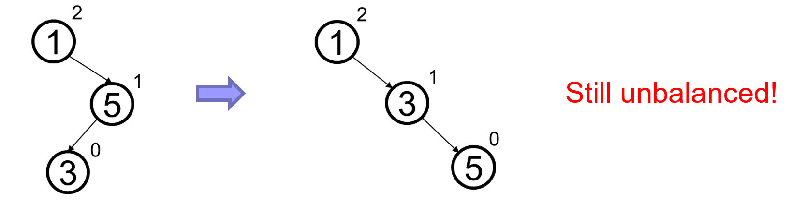

## AVL Insert:
> ### Double rotation  

If we do both single rotations, starting with the second, it works! 

Double rotation: 
* Rotate problematic child and grandchild
* Rotate between self and new child

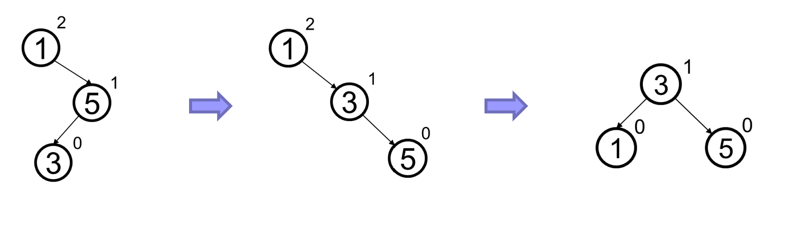

> General Case - right-left case 

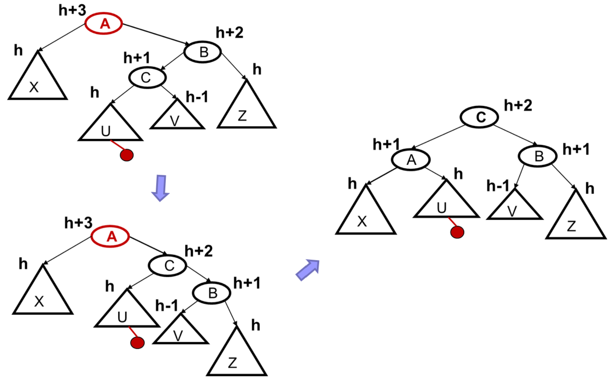

Important points (right-left case):

* Does not have to be implemented as two rotations; can just do:

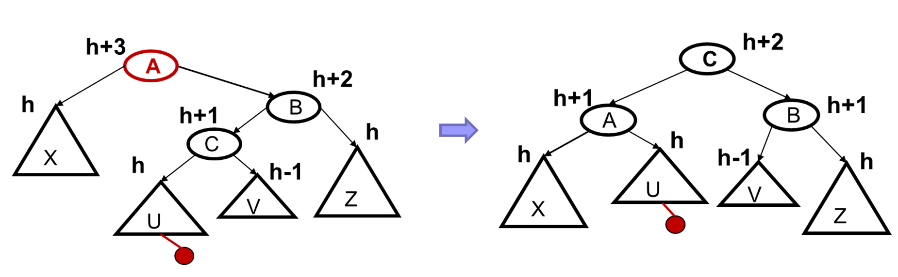

Easier to remember than you may think:

Move C to grandparent’s position

Put A, B, X, U, and V in the only legal positions for a BST 


> General case: left-right case:

The left-right is the mirror image of the right-left case

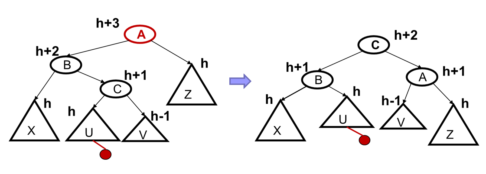

# Insert: Summarized Ideas  

* Insert as in a BST

* Check back up path for imbalance height, which will be:
    * Node’s left-left grandchild is too tall (Left Left Case)
    * Node’s left-right grandchild is too tall (Left Right Case)
    * Node’s right-left grandchild is too tall (Right Left Case)
    * Node’s right-right grandchild is too tall (Right Right Case)

* Note that only one case occurs because tree was balanced before insert

* After the single or double rotation, the smallest-unbalanced subtree has the same height as before the insertion

## AVL Trees: Efficiency   

Worst-case complexity of find: O(logN)
* Tree is balanced

Worst-case complexity of insert: O(logN)
* Tree starts balanced
* A rotation is O(1) and there’s an O(logN) path to root
* Tree ends balanced

Worst-case complexity of buildTree with N nodes: O(NlogN)


GIF illustrating rotations.

##  AVL Code Sample

Courtesy of http://users.cis.fiu.edu/~weiss/dsaajava/code/DataStructures/AvlTree.java
```java
    // BinarySearchTree class
    //
    // CONSTRUCTION: with no initializer
    //
    // ******************PUBLIC OPERATIONS*********************
    // void insert( x )       --> Insert x
    // void remove( x )       --> Remove x (unimplemented)
    // Comparable find( x )   --> Return item that matches x
    // Comparable findMin( )  --> Return smallest item
    // Comparable findMax( )  --> Return largest item
    // boolean isEmpty( )     --> Return true if empty; else false
    // void makeEmpty( )      --> Remove all items
    // void printTree( )      --> Print tree in sorted order

    /**
     * Implements an AVL tree.
     * Note that all "matching" is based on the compareTo method.
     * @author Mark Allen Weiss
     */
    public class AvlTree
    {
        /**
         * Construct the tree.
         */
        public AvlTree( )
        {
            root = null;
        }

        /**
         * Insert into the tree; duplicates are ignored.
         * @param x the item to insert.
         */
        public void insert( Comparable x )
        {
            root = insert( x, root );
        }

        /**
         * Remove from the tree. Nothing is done if x is not found.
         * @param x the item to remove.
         */
        public void remove( Comparable x )
        {
            System.out.println( "Sorry, remove unimplemented" );
        }

        /**
         * Find the smallest item in the tree.
         * @return smallest item or null if empty.
         */
        public Comparable findMin( )
        {
            return elementAt( findMin( root ) );
        }

        /**
         * Find the largest item in the tree.
         * @return the largest item of null if empty.
         */
        public Comparable findMax( )
        {
            return elementAt( findMax( root ) );
        }

        /**
         * Find an item in the tree.
         * @param x the item to search for.
         * @return the matching item or null if not found.
         */
        public Comparable find( Comparable x )
        {
            return elementAt( find( x, root ) );
        }

        /**
         * Make the tree logically empty.
         */
        public void makeEmpty( )
        {
            root = null;
        }

        /**
         * Test if the tree is logically empty.
         * @return true if empty, false otherwise.
         */
        public boolean isEmpty( )
        {
            return root == null;
        }

        /**
         * Print the tree contents in sorted order.
         */
        public void printTree( )
        {
            if( isEmpty( ) )
                System.out.println( "Empty tree" );
            else
                printTree( root );
        }

        /**
         * Internal method to get element field.
         * @param t the node.
         * @return the element field or null if t is null.
         */
        private Comparable elementAt( AvlNode t )
        {
            return t == null ? null : t.element;
        }

        /**
         * Internal method to insert into a subtree.
         * @param x the item to insert.
         * @param t the node that roots the tree.
         * @return the new root.
         */
        private AvlNode insert( Comparable x, AvlNode t )
        {
            if( t == null )
                t = new AvlNode( x, null, null );
            else if( x.compareTo( t.element ) < 0 )
            {
                t.left = insert( x, t.left );
                if( height( t.left ) - height( t.right ) == 2 )
                    if( x.compareTo( t.left.element ) < 0 )
                        t = rotateWithLeftChild( t );
                    else
                        t = doubleWithLeftChild( t );
            }
            else if( x.compareTo( t.element ) > 0 )
            {
                t.right = insert( x, t.right );
                if( height( t.right ) - height( t.left ) == 2 )
                    if( x.compareTo( t.right.element ) > 0 )
                        t = rotateWithRightChild( t );
                    else
                        t = doubleWithRightChild( t );
            }
            else
                ;  // Duplicate; do nothing
            t.height = max( height( t.left ), height( t.right ) ) + 1;
            return t;
        }

        /**
         * Internal method to find the smallest item in a subtree.
         * @param t the node that roots the tree.
         * @return node containing the smallest item.
         */
        private AvlNode findMin( AvlNode t )
        {
            if( t == null )
                return t;

            while( t.left != null )
                t = t.left;
            return t;
        }

        /**
         * Internal method to find the largest item in a subtree.
         * @param t the node that roots the tree.
         * @return node containing the largest item.
         */
        private AvlNode findMax( AvlNode t )
        {
            if( t == null )
                return t;

            while( t.right != null )
                t = t.right;
            return t;
        }

        /**
         * Internal method to find an item in a subtree.
         * @param x is item to search for.
         * @param t the node that roots the tree.
         * @return node containing the matched item.
         */
        private AvlNode find( Comparable x, AvlNode t )
        {
            while( t != null )
                if( x.compareTo( t.element ) < 0 )
                    t = t.left;
                else if( x.compareTo( t.element ) > 0 )
                    t = t.right;
                else
                    return t;    // Match

            return null;   // No match
        }

        /**
         * Internal method to print a subtree in sorted order.
         * @param t the node that roots the tree.
         */
        private void printTree( AvlNode t )
        {
            if( t != null )
            {
                printTree( t.left );
                System.out.println( t.element );
                printTree( t.right );
            }
        }

        /**
         * Return the height of node t, or -1, if null.
         */
        private static int height( AvlNode t )
        {
            return t == null ? -1 : t.height;
        }

        /**
         * Return maximum of lhs and rhs.
         */
        private static int max( int lhs, int rhs )
        {
            return lhs > rhs ? lhs : rhs;
        }

        /**
         * Rotate binary tree node with left child.
         * For AVL trees, this is a single rotation for case 1.
         * Update heights, then return new root.
         */
        private static AvlNode rotateWithLeftChild( AvlNode k2 )
        {
            AvlNode k1 = k2.left;
            k2.left = k1.right;
            k1.right = k2;
            k2.height = max( height( k2.left ), height( k2.right ) ) + 1;
            k1.height = max( height( k1.left ), k2.height ) + 1;
            return k1;
        }

        /**
         * Rotate binary tree node with right child.
         * For AVL trees, this is a single rotation for case 4.
         * Update heights, then return new root.
         */
        private static AvlNode rotateWithRightChild( AvlNode k1 )
        {
            AvlNode k2 = k1.right;
            k1.right = k2.left;
            k2.left = k1;
            k1.height = max( height( k1.left ), height( k1.right ) ) + 1;
            k2.height = max( height( k2.right ), k1.height ) + 1;
            return k2;
        }

        /**
         * Double rotate binary tree node: first left child
         * with its right child; then node k3 with new left child.
         * For AVL trees, this is a double rotation for case 2.
         * Update heights, then return new root.
         */
        private static AvlNode doubleWithLeftChild( AvlNode k3 )
        {
            k3.left = rotateWithRightChild( k3.left );
            return rotateWithLeftChild( k3 );
        }

        /**
         * Double rotate binary tree node: first right child
         * with its left child; then node k1 with new right child.
         * For AVL trees, this is a double rotation for case 3.
         * Update heights, then return new root.
         */
        private static AvlNode doubleWithRightChild( AvlNode k1 )
        {
            k1.right = rotateWithLeftChild( k1.right );
            return rotateWithRightChild( k1 );
        }

          /** The tree root. */
        private AvlNode root;


            // Test program
        public static void main( String [ ] args )
        {
            AvlTree t = new AvlTree( );
            final int NUMS = 4000;
            final int GAP  =   37;

            System.out.println( "Checking... (no more output means success)" );

            for( int i = GAP; i != 0; i = ( i + GAP ) % NUMS )
                t.insert( new MyInteger( i ) );

            if( NUMS < 40 )
                t.printTree( );
            if( ((MyInteger)(t.findMin( ))).intValue( ) != 1 ||
                ((MyInteger)(t.findMax( ))).intValue( ) != NUMS - 1 )
                System.out.println( "FindMin or FindMax error!" );

            for( int i = 1; i < NUMS; i++ )
                 if( ((MyInteger)(t.find( new MyInteger( i ) ))).intValue( ) != i )
                     System.out.println( "Find error1!" );
    }
}
```

## Class Practice

Given a binary tree, write an efficient algorithm to check if it is height-balanced or not. In a height-balanced tree, the absolute difference between the height of the left and right subtree for every node is 0 or 1.

For example,

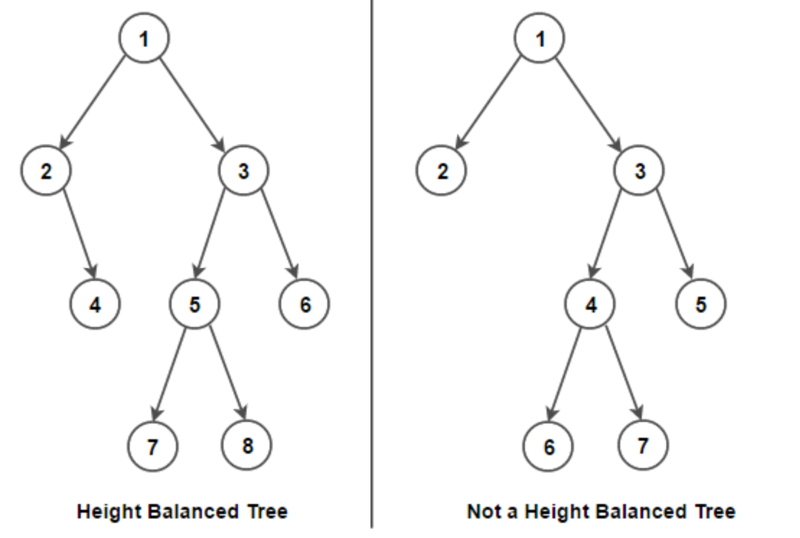

A simple solution would be to calculate the height of the left and right subtree for each node in the tree. If for any node, the absolute difference between the height of its left and right subtree is more than 1, the tree is unbalanced. The time complexity of this solution is O(n2) as there are n nodes in the tree, and for every node, we are calculating the height of its left and right subtree that takes O(n) time.

 
We can solve this problem in linear time by doing a postorder traversal on the tree. Instead of calculating the height of the left and right subtree for every tree node, we can get the height in constant time. The idea is to start from the bottom of the tree and return the height of the subtree rooted at the given node to its parent. The height of a subtree rooted at any node is one more than the maximum height of the left subtree or the right subtree.

```java

import java.util.concurrent.atomic.AtomicBoolean;
 
// A class to store a binary tree node
class Node
{
    int data;
    Node left = null, right = null;
 
    Node(int data) {
        this.data = data;
    }
}
 
class Main
{
    // Recursive function to check if a given binary tree is height-balanced or not
    public static int isHeightBalanced(Node root, AtomicBoolean isBalanced)
    {
       //todo
    }
 
    // The main function to check if a given binary tree is height-balanced or not
    public static boolean isHeightBalanced(Node root)
    {
        // use `AtomicBoolean` to get the result since `Boolean` is passed by value
        // in Java
        AtomicBoolean isBalanced = new AtomicBoolean(true);
        isHeightBalanced(root, isBalanced);
 
        return isBalanced.get();
    }
 
    public static void main(String[] args)
    {
        /* Construct the following tree
                  1
                /   \
               /     \
              2       3
             / \     /
            4   5   6
        */
 
        Node root = new Node(1);
        root.left = new Node(2);
        root.right = new Node(3);
        root.left.left = new Node(4);
        root.left.right = new Node(5);
        root.right.left = new Node(6);
 
        if (isHeightBalanced(root)) {
            System.out.println("Binary tree is balanced");
        }
        else {
            System.out.println("Binary tree is not balanced");
        }
    }
}
```
